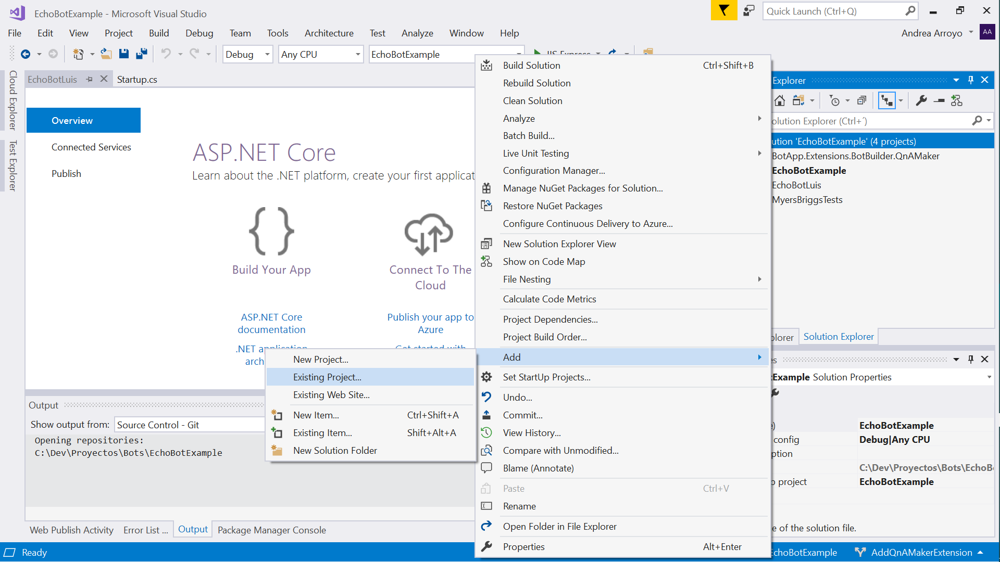
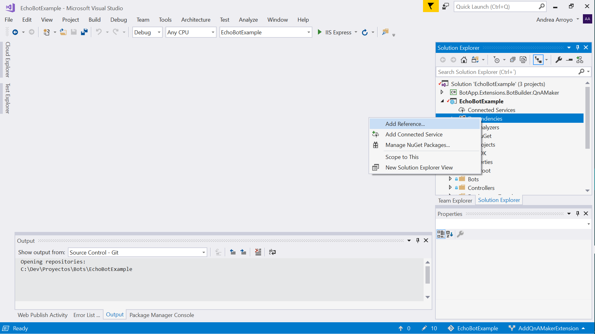

## Intro

<b>What are Bot Extensions?</b>

Bot Extensions are encapsulating services that integrate with your bot in order for you to focus in its development, allow rapid deployment with multiple integrating services and to show best practices of implementation.


## Download the project

- Download / clone repo 
```bash
`git clone https://github.com/robece/bot-extensions.git`
```

## Prerequisites 

- <a href="https://github.com/Microsoft/botbuilder-samples.git" target="_blank">Create Bot Application</a> or <a href="https://marketplace.visualstudio.com/items?itemName=BotBuilder.botbuilderv4" target="_blank">Install Visual Studio Bot Templates</a>.

 - Right click in bot project, properties and target to              __netcore 2.2__.
       <a href="https://dotnet.microsoft.com/download/dotnet-core/2.2" target="_blank">Download netcore 2.2</a>.

- Go to Visual Studio, right click on solution and Add Existing project.
    - Choose your extension project.

    <br />
    <div style="text-align:center">
        
    </div>

- In your main Bot project right click on dependencies.
    - Click on Add Reference.
    - Choose your extension project/s.

    <br />
    <div style="text-align:center">
        
    </div>

## Steps

1. Edit __appsettings.json__ file to add extension configuration.
2. Change __Startup.cs__ file and create extension instance. 
3. Use extension instance methods.


## Available Extensions

- __Key Vault__: is a service to to safeguard and manage cryptographic keys and secrets used by cloud applications and services.
    + <a href="https://github.com/robece/bot-extensions/tree/master/source/Extensions.Common.KeyVault" target="_blank">Go to Extension</a>
    + <a href="https://docs.microsoft.com/en-us/azure/key-vault/" target="_blank">Go to Documentation</a>

- __Active Directory__: is a multi-tenant, cloud-based identity and access management service.
    + <a href="https://github.com/robece/bot-extensions/tree/master/source/Extensions.BotBuilder.ActiveDirectory" target="_blank">Go to Extension</a>
    + <a href="https://docs.microsoft.com/en-us/azure/active-directory/" target="_blank">Go to Documentation</a>

- __QnA__: is a cloud-based API service that creates a conversational, question-and-answer layer over your data.
    + <a href="https://github.com/robece/bot-extensions/tree/master/source/Extensions.BotBuilder.QnAMaker" target="_blank">Go to Extension</a>
    + <a href="https://docs.microsoft.com/en-us/azure/cognitive-services/qnamaker" target="_blank">Go to Documentation</a>

- __Luis__: is a machine learning-based service to build natural language understanding into apps, bots, and IoT devices.   
    + <a href="https://github.com/robece/bot-extensions/tree/master/source/Extensions.BotBuilder.Luis" target="_blank">Go to Extension</a>
    + <a href="https://azure.microsoft.com/en-us/services/cognitive-services/language-understanding-intelligent-service" target="_blank">Go to Documentation</a>

- __Translator__: is a cloud-based machine translation service you can use to translate text in near real-time through a simple REST API call.  
    + <a href="https://github.com/robece/bot-extensions/tree/master/source/Extensions.Common.Translator" target="_blank">Go to Extension</a>
    + <a href="https://docs.microsoft.com/en-us/azure/cognitive-services/translator/" target="_blank">Go to Documentation</a>

## Features table

| | Security | Cognitive Services |
|-------------------|----------|-------------------|
| Key Vault         | ✅      |                   |
| Active Directory  | ✅      |                   |
| QnA               |          | ✅            |
| Luis              |          | ✅               |
| Translator        |          | ✅              |

## How it all fits together

<br />
<div style="text-align:center">
    
</div>

## FAQ 

Why use extensions instead of adding the functionality in my bot app?
Extensions help maintain integrating service code apart and modularized in order for better legibility and guide your development through some development practices.  

Are the extensions limited?
No, you can continue extending functionalities by adding new extensions to your forked repo or if you want to contribute send us a pull request with your features.

## Credits

I want to thank <a href="https://github.com/andyarroyo5">Andrea Arroyo</a> for her contribution on this project.