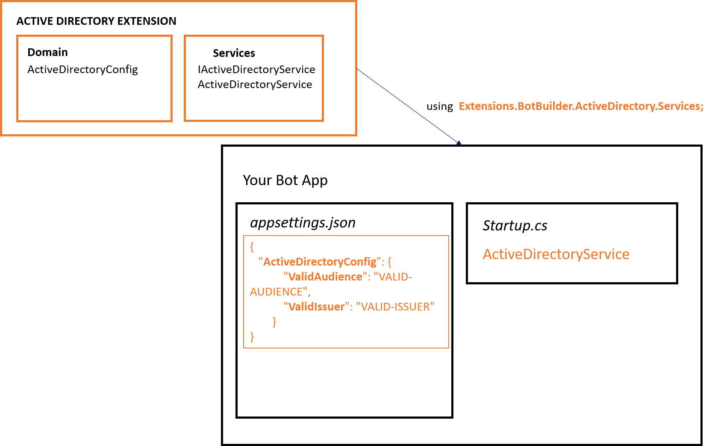

## Intro

Extension: Active Directory

Azure Active Directory (Azure AD) is Microsoft’s cloud-based identity and access management service, which helps your employee's sign in and access resources in:

- External resources, such as Microsoft Office 365, the Azure portal, and thousands of other SaaS applications.

- Internal resources, such as apps on your corporate network and intranet, along with any cloud apps developed by your own organization.

<a href="https://docs.microsoft.com/en-us/azure/active-directory/fundamentals/active-directory-whatis" target="_blank">Go to Documentation</a>.

## Implementation

1. Edit __appsettings.json__ file in your main bot project and add LUIS extension configuration.

    ```json 
    {
        "ActiveDirectoryConfig": {
            "ValidAudience": "VALID-AUDIENCE",
            "ValidIssuer": "VALID-ISSUER"      
        }
    }
    ```

2. Modify __Startup.cs__ with the following changes.

    - Add usings:
        ```csharp
         using Extensions.BotBuilder.ActiveDirectory.Services;         
        ```
    - Add ContentRoot variables:
         ```csharp
        public static string ContentRootPath { get; set; }  
        public static string EnvironmentName { get; set; }
      
        ```
    -  Modify Startup method with the following:
        ```csharp
        public Startup(IConfiguration configuration, IHostingEnvironment env)
        {
            Configuration = configuration;
            ContentRootPath = env.ContentRootPath;
            EnvironmentName = env.EnvironmentName;
        }
        ```
    - Create *ActiveDirectoryService* instance. In method __ConfigureServices__: 
        ```csharp
            // Adding Active Directory service
            services.AddSingleton<IActiveDirectoryService>(sp => 
            { 
                return new ActiveDirectoryService(EnvironmentName, ContentRootPath);
            });
        ```       

3. Use your instance methods.

## How it all fits together

<br />
<div style="text-align:center">
    
</div>

## Unit Tests 

<a href="https://github.com/robece/bot-extensions/blob/master/source/Extensions.Tests/ActiveDirectoryServiceTest.cs" target="_blank">Go to Unit Tests</a>.