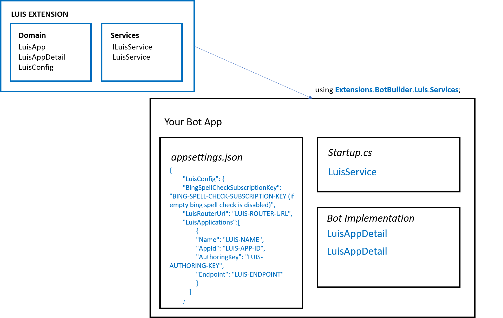

## Intro

Extension: Language Understanding (LUIS)

A machine learning-based service to build natural language 
understanding into apps, bots, and IoT devices.

<a href="https://azure.microsoft.com/en-us/services/cognitive-services/language-understanding-intelligent-service" target="_blank">Go to Documentation</a>.

## Implementation

1. Edit __appsettings.json__ file in your main bot project and add LUIS extension configuration.

    ```json 
    {
        "LuisConfig": {
        "BingSpellCheckSubscriptionKey": "BING-SPELL-CHECK-SUBSCRIPTION-KEY (if empty bing spell check is disabled)",
        "LuisRouterUrl": "LUIS-ROUTER-URL",
        "LuisApplications":[
                {
                "Name": "LUIS-NAME",
                "AppId": "LUIS-APP-ID",
                "AuthoringKey": "LUIS-AUTHORING-KEY",
                "Endpoint": "LUIS-ENDPOINT"
                }
            ]
        }
    }
    ```

2. Modify __Startup.cs__ with the following changes.

    - Add usings:
        ```csharp
         using Extensions.BotBuilder.Luis.Services;
         
        //for HttpClientHandler
        using System.Net.Http;
        ```
    - Add ContentRoot variables:
         ```csharp
        public static string ContentRootPath { get; set; }  
        public static string EnvironmentName { get; set; }
      
        ```
    -  Modify Startup method with the following:
        ```csharp
        public Startup(IConfiguration configuration, IHostingEnvironment env)
        {
            Configuration = configuration;
            ContentRootPath = env.ContentRootPath;
            EnvironmentName = env.EnvironmentName;

        }
        ```
    - Create *LuisService* instance. In method __ConfigureServices__:
        ```csharp 
        //Constructor- (for reference only)
        public LuisService(string environmentName, string contentRootPath, IBotTelemetryClient botTelemetryClient = null, HttpClientHandler httpClientHandler = null)

            //Option 1 
                public void ConfigureServices(IServiceCollection services)
                { 
                        [...]
                        services.AddSingleton<LuisService>(l =>
                        {
                            return new LuisService(EnvironmentName, ContentRootPath);
                        });

                }
            
            //Option 2 : Adding HttpClient and HttpClientHandler          
            
                var handler = new HttpClientHandler();
                handler.ServerCertificateCustomValidationCallback = (message, cert, chain, errors) => true;
               

                //Create instance
                services.AddSingleton<LuisService>(l =>
                        {
                            return new LuisService(EnvironmentName, ContentRootPath, null, handler);
                        });
            
            
            //Option 3 : Adding BotTelemetry            
        ```
3. Use your instance methods.

    - Recognizing one or multiple apps:
        ```csharp
        //Create a luisResult object to get intents and score
        LuisResult luisResult = new LuisResult();

        List<IntentModel> intents = new List<IntentModel>();
        intents.Add(new IntentModel() { Intent = expectedIntent, Score = 100 });

        luisResult.Intents = intents;
        luisResult.Entities = new List<EntityModel>();
        var jsonRecognizerResult = JsonConvert.SerializeObject(luisResult);
        var result = await luisService.LuisServices["name"].RecognizeAsync(step.Context, new CancellationToken());
        ```

    -  Recognize Multiple Apps:
        ```csharp
        //Create a luisResult object to get intents and score
        LuisResult luisResult = new LuisResult();

        List<IntentModel> intents = new List<IntentModel>();
        intents.Add(new IntentModel() { Intent = expectedIntent, Score = 100 });

        luisResult.Intents = intents;
        luisResult.Entities = new List<EntityModel>();
        var jsonRecognizerResult = JsonConvert.SerializeObject(luisResult);
        var result = await luisService.LuisServices["name"].RecognizeInMultipleAppsAsync(step.Context, new CancellationToken());                       
        ```

## How it all fits together

<br />
<div style="text-align:center">
    
</div>

## Unit Tests 

<a href="https://github.com/robece/bot-extensions/blob/master/source/Extensions.Tests/LuisServiceTest.cs" target="_blank">Go to Unit Tests</a>.