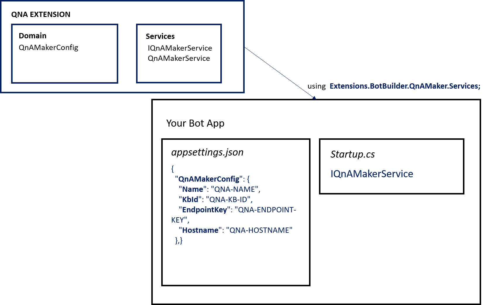

## Intro

Extension: QnA Maker

QnA Maker is a cloud-based API service that creates a conversational, question-and-answer layer over your data.

<a href="https://docs.microsoft.com/en-us/azure/cognitive-services/QnAMaker/index" target="_blank">Go to Documentation</a>.

## Implementation

1. Edit __appsettings.json__ file in your main bot project and add LUIS extension configuration.

    ```json 
    {
         "QnAMakerConfig": {
            "Name": "QNA-NAME",
            "KbId": "QNA-KB-ID",
            "EndpointKey": "QNA-ENDPOINT-KEY",
            "Hostname": "QNA-HOSTNAME"
        }
    }
    ```

2. Modify __Startup.cs__ with the following changes.

    - Add usings:
        ```csharp
         using Extensions.BotBuilder.QnAMaker.Services;
         
        //for HttpClientHandler
        using System.Net.Http;

        //for Telemetry 
            using Microsoft.Bot.Builder.ApplicationInsights;
            using Microsoft.Bot.Builder.Integration.ApplicationInsights.Core;
        ```
    - Add ContentRoot variables:
         ```csharp
        public static string ContentRootPath { get; set; }  
        public static string EnvironmentName { get; set; }
      
        ```
    -  Modify Startup method with the following:
        ```csharp
        public Startup(IConfiguration configuration, IHostingEnvironment env)
        {
            Configuration = configuration;
            ContentRootPath = env.ContentRootPath;
            EnvironmentName = env.EnvironmentName;

        }
        ```
    - Create *QnAService* instance. In method __ConfigureServices__:
        ```csharp
        //Constructor- (for reference only)
        public QnAMakerService(HttpClient httpClient, string environmentName, string contentRootPath, IBotTelemetryClient botTelemetryClient = null)
       
            //Option 1 : Adding HttpClient and HttpClientHandler          
            
                var handler = new HttpClientHandler();
                handler.ServerCertificateCustomValidationCallback = (message, cert, chain, errors) => true;
                var httpClient = new HttpClient(handler);

                //Create instance
                 // Adding QnAMaker Router service
            services.AddSingleton<IQnAMakerService>(sp => 
            {         return new QnAMakerService(httpClient, EnvironmentName, ContentRootPath);
             });
            
            //Option 2 : Adding BotTelemetry
        
            // Adding telemetry
            ConfigureTelemetry(services);

            services.AddSingleton<IQnAMakerService>(sp => 
            {         
                return new QnAMakerService(httpClient, EnvironmentName, ContentRootPath,sp.GetRequiredService<IBotTelemetryClient>());
             });    

            //Add method ConfigureTelemetry
             private void ConfigureTelemetry(IServiceCollection services)
             {
                    // Add Application Insights services into service collection
                    services.AddApplicationInsightsTelemetry();

                    // Add the standard telemetry client
                    services.AddSingleton<IBotTelemetryClient, BotTelemetryClient>();

                    // Add ASP middleware to store the HTTP body, mapped with bot activity key, in the httpcontext.items
                    // This will be picked by the TelemetryBotIdInitializer
                    services.AddTransient<TelemetrySaveBodyASPMiddleware>();

                    // Add telemetry initializer that will set the correlation context for all telemetry items
                    services.AddSingleton<ITelemetryInitializer, OperationCorrelationTelemetryInitializer>();

                    // Add telemetry initializer that sets the user ID and session ID (in addition to other
                    // bot-specific properties, such as activity ID)
                    services.AddSingleton<ITelemetryInitializer, TelemetryBotIdInitializer>();

                    // Create the telemetry middleware to track conversation events
                    services.AddSingleton<IMiddleware, TelemetryLoggerMiddleware>();
            }
        ```       
3. Use your instance methods.

## How it all fits together

<br />
<div style="text-align:center">
    
</div>

## Unit Tests 

<a href="https://github.com/robece/bot-extensions/blob/master/source/Extensions.Tests/QnAMakerServiceTest.cs" target="_blank">Go to Unit Tests</a>.