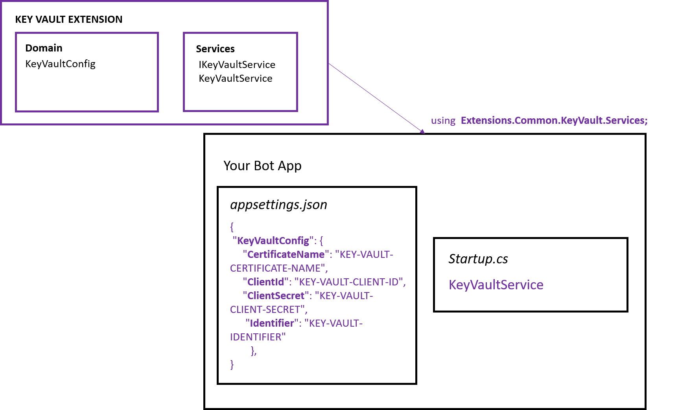

## Intro

Extension: Key Vault

Key Vault service is used to safeguard and manage cryptographic keys and secrets used by cloud applications and services. 

<a href="https://docs.microsoft.com/en-us/azure/key-vault/" target="_blank">Go to Documentation</a>.

## Implementation

1. Edit __appsettings.json__ file in your main bot project and add LUIS extension configuration.

    ```json 
    {
        "KeyVaultConfig": {
            "CertificateName": "KEY-VAULT-CERTIFICATE-NAME",
            "ClientId": "KEY-VAULT-CLIENT-ID",
            "ClientSecret": "KEY-VAULT-CLIENT-SECRET",
            "Identifier": "KEY-VAULT-IDENTIFIER"
        }
    }
    ``` 

2. Modify __Startup.cs__ with the following changes.

    - Add usings:
        ```csharp
         using Extensions.Common.KeyVault.Services;         
        ```
    - Add ContentRoot variables:
         ```csharp
        public static string ContentRootPath { get; set; }  
        public static string EnvironmentName { get; set; }
      
        ```
    -  Modify Startup method with the following:
        ```csharp
        public Startup(IConfiguration configuration, IHostingEnvironment env)
        {
            Configuration = configuration;
            ContentRootPath = env.ContentRootPath;
            EnvironmentName = env.EnvironmentName;

        }
        ```
    - Create *LuisService* instance. In method __ConfigureServices__:
        ```csharp      
            // Adding KeyVault service
            services.AddSingleton<IKeyVaultService>(sp => 
            {
                return new KeyVaultService(EnvironmentName, ContentRootPath);
            });
        ```
    3. Use extension.

## How it all fits together

<br />
<div style="text-align:center">
    
</div>

## Unit Tests 

<a href="https://github.com/robece/bot-extensions/blob/master/source/Extensions.Tests/KeyVaultServiceTest.cs" target="_blank">Go to Unit Tests</a>.