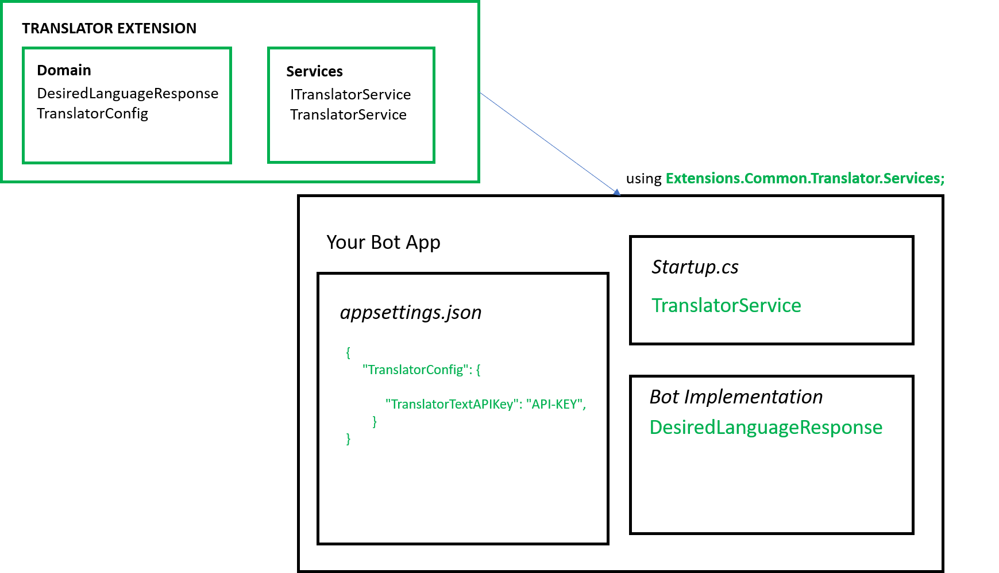

## Intro

Extension: Translator

Translator Text is a cloud-based machine translation service you can use to translate text in near real-time through a simple REST API call.

<a href="https://azure.microsoft.com/en-us/services/cognitive-services/language-understanding-intelligent-service" target="_blank">Go to Documentation</a>.

## Implementation

1. Edit __appsettings.json__ file in your main bot project and add LUIS extension configuration.

    ```json 
    {
        [...]

        "TranslatorConfig": {

            "TranslatorTextAPIKey": "API-KEY",       
        }
    }
    ```

2. Modify __Startup.cs__ with the following changes.

    - Add usings:
        ```csharp
        using Extensions.Common.Translator.Services;
        
        //for HttpClient
        using System.Net.Http;

        ```
    - Add ContentRoot variables:
         ```csharp
        public static string ContentRootPath { get; set; }  
        public static string EnvironmentName { get; set; }
      
        ```
    -  Modify Startup method with the following:
        ```csharp
        public Startup(IConfiguration configuration, IHostingEnvironment env)
        {
            Configuration = configuration;
            ContentRootPath = env.ContentRootPath;
            EnvironmentName = env.EnvironmentName;

        }
        ```
    - Create *TranslatorService* instance. In method __ConfigureServices__:
      ```c#   
       //Constructor- for reference only           
        public TranslatorService(HttpClient httpClient, string environmentName, string contentRootPath)

       
        // Adding HttpClient and HttpClientHandler
        var handler = new HttpClientHandler();
        handler.ServerCertificateCustomValidationCallback = (message, cert, chain, errors) => true;      
        var httpClient = new HttpClient(handler);

        services.AddSingleton<ITranslatorService>(t =>
        {
            return new TranslatorService(httpClient,EnvironmentName, ContentRootPath);
        });
        
3. Use extension.

## How it all fits together

<br />
<div style="text-align:center">
    
</div>

## Unit Tests 

<a href="https://github.com/robece/bot-extensions/blob/master/source/Extensions.Tests/TranslatorServiceTest.cs" target="_blank">Go to Unit Tests</a>.